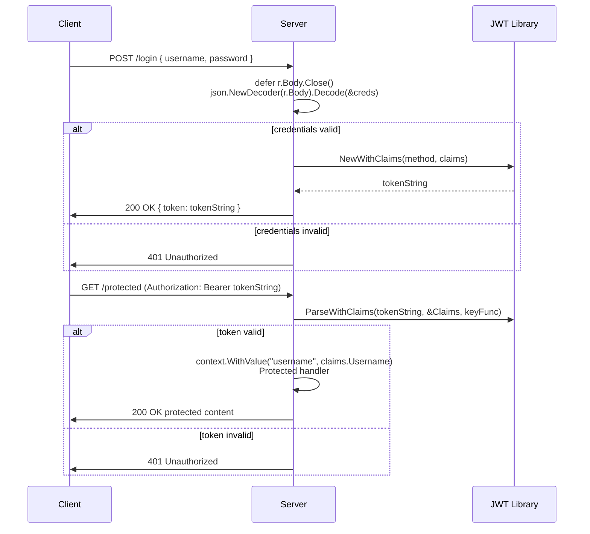

# go-jwt-api

```mermaid
sequenceDiagram
    participant Client
    participant Server
    participant JWTLib as JWT Library

    Client->>Server: POST /login { username, password }
    Server->>Server: defer r.Body.Close()<br>json.NewDecoder(r.Body).Decode(&creds)
    alt credentials valid
        Server->>JWTLib: NewWithClaims(method, claims)  
        JWTLib-->>Server: tokenString
        Server->>Client: 200 OK { token: tokenString }
    else credentials invalid
        Server->>Client: 401 Unauthorized
    end

    Client->>Server: GET /protected (Authorization: Bearer tokenString)
    Server->>JWTLib: ParseWithClaims(tokenString, &Claims, keyFunc)
    alt token valid
        Server->>Server: context.WithValue("username", claims.Username)<br>Protected handler
        Server->>Client: 200 OK protected content
    else token invalid
        Server->>Client: 401 Unauthorized
    end
```
